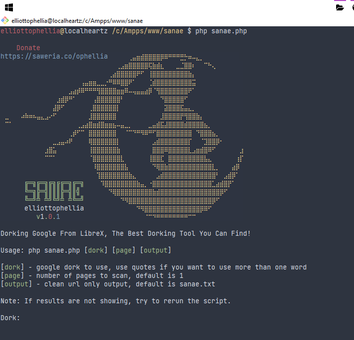

<h1>Sanae</h1>

   

A PHP-CLI script for dorking Google from LibreX, easy and fast to use, if result are not showing, try to rerun the script.

<h1>Installation</h1>
<pre>git clone https://github.com/elliottophellia/sanae
cd sanae
php sanae.php [dork] [page] [output]</pre>
